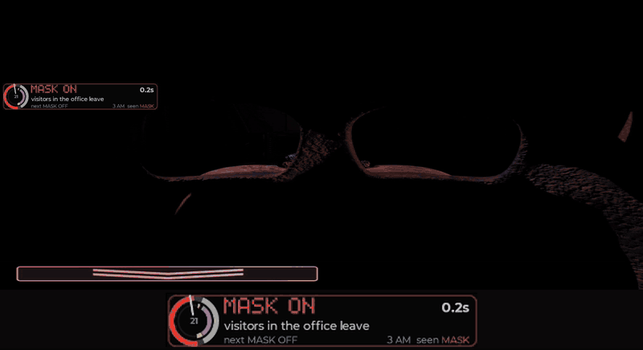
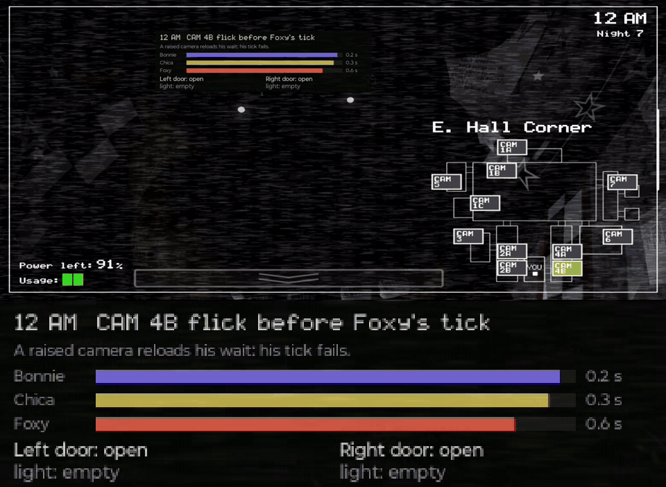

# fnaf2-1020

An evidence-driven study of the modern Android *Five Nights at Freddy's 2*
target: `com.scottgames.fnaf2` v2.0.7, release-7 / Fusion build 296. Its vision
is a faithful, inspectable understanding of 10/20; its mission is to understand,
derive, embody, and prove control without turning a model result into a device
claim.

The canonical target is Android. PC equivalence, device-general calibration, and
a live controller result above its evidence rung are not claimed. Game assets
and decompiled content are never distributed.



*The **Minus Toys** cycle, played by the bot on the phone. Minus Toys is
Zach_Scream's 2025 zero-RNG technique for 10/20
([the lineage](docs/strategy/MINUS-3-STRATEGY.md)); this is binding k3's version
of it, one whole 10-second cycle of Night 7 with all ten dials at 20, at 3 AM
(cycle 22, 2026-09-18, from the run's video). A double camera glitch leaves the
feed on Prize Corner with the marker parked on CAM 09, so every camera flash
freezes all three Toys on the Show Stage for 6.7 s. The cycle: mask off, a hall
flash for Foxy, cams up onto that split, the camera flash, three seconds of
winding for the Puppet, the cams dropped with the light held so it flashes the
hall, and the mask worn for the remaining 5.25 s. The panel at the left, enlarged
2x in the strip underneath, is the Cue Helper's teach panel
(`night-run.sh --teach-overlay`) for someone watching: the ring is the cycle
(outer band: mask, cams or office; inner band: the flashes and the wind; the hand
is now), the title is the step the schedule is on, and `seen` is what the helper
reads off the screen, trailing each press by the game's own animation.*

## Where this stands — 2026-09-18

Every story night and Custom Night 10/20 have reached 6 AM on the phone. The
handset is a Moto g56 `ZF525F5BH5` running `com.scottgames.fnaf2:2.0.7+26` under
profile `hid-mediaprojection`.

| Night | First 6 AM | Record |
|---|---|---|
| 1–2 | 2026-09-07 | [`victory-night1`](docs/evidence/victory-night1-20260907.json), [`victory-night2`](docs/evidence/victory-night2-20260907.json) |
| 3–4 | 2026-09-08 | [`victory-night3`](docs/evidence/victory-night3-20260908.json), [`victory-night4`](docs/evidence/victory-night4-20260908.json) |
| 5 | 2026-09-12 | [`night5-first-6am`](docs/evidence/night5-first-6am-20260912.md) — four Night 5 clears are recorded |
| 6 | 2026-09-13 | [`night6-first-6am-anchoredh`](docs/evidence/night6-first-6am-anchoredh-20260913.md) — Custom Night unlocked |
| 7 (**10/20**) | 2026-09-14 | [`night7-first-6am-k2`](docs/evidence/night7-first-6am-k2-20260914.json) — `golden-freddy`, all ten dials 20 |

Read those numbers precisely. Each run is retained at `DEVICE_MEASURED` for its
own terminal, and **no Plan 12 promotion edge has been recorded for any of
them**, so nothing above is a promoted claim. Night 7's reliability is two
predeclared ten-run cohorts: binding k2 at [**3 wins, 7 deaths**](docs/evidence/night7-cohort-k2-result-20260914.json)
on 2026-09-14, and binding k3 at [**8 wins, 2 deaths**](docs/evidence/night7-cohort-k3-result-20260918.json)
on 2026-09-18, both k3 losses to Foxy on the first office frame after a mask-off press.
A single clear and a reliability claim are different claims, and
[Plan 12](plans/12-end-to-end-evidence-campaign.md) owns the ladder between them.

**A second game: FNaF 1 4/20 won on the phone (2026-09-25).** Custom Night
20/20/20/20 reached 6 AM on the first attempt, read entirely through the Cue
Helper's native-frame regions and driven by a route priced at the handset's
measured touch costs ([`fnaf1-420-first-6am`](docs/evidence/fnaf1-420-first-6am-20260925.json)).
Four nights so far: both without a screen recording running reached 6 AM, and
both with one died, because any `screenrecord` halves the helper's frames.



*One Bonnie visit on FNaF 1's 4/20, at 12 AM (`420-d`, 2026-09-25, from the
run's video). Bonnie, Chica and Foxy each move only on their own clock -- every
4.97, 4.98 and 5.01 s from the night's first frame -- and the route lives on
those clocks: a CAM 4B flick just before each of Foxy's ticks holds him and
keeps Freddy out, each doorway is lit once after a tick that could have brought
someone to it, and a door is shut ahead of the tick that turns its occupant back
and reopened once the light through it shows him gone. The panel is the
Companion's FNaF 1 teach panel (`fnaf1-custom-run.sh --teach`): the step and why,
the three clocks filling toward their next tick, and each door with what its
light last showed.*

**All ten Custom Night presets are viable — in the model.** Night 7 here had only
ever meant canonical 10/20; the other nine menu presets are different AI vectors
on the same night-7 rules and had never been asked. On 2026-09-17 all ten cleared
**3000/3000 in all four lanes** — exact, exact worst, device, device worst — at a
per-press lateness band wider than the phone's own worst measured per-cycle
spread on this route. That is 120,000 simulated nights with no loss, and it is
`MODEL_ONLY`: **no phone was run for it.**

The ten green rows are not the finding. Getting them took one knob, and the
reason is a floor. `hallOffsetMs` 9500 put the Foxy-reset hall pulse 300 ms after
the mask-OFF press; `MASK_ANIM_OFF` is 250 ms and `lit?` needs `mask = 0`, so the
pulse cleared the animation it depends on by **50 ms** — narrower than the
phone's own measured displacement. When that gap closes there is no light, Foxy
is never reset, and he takes the night: at a 0–100 ms band the shipped offset
scored 107/200 on 10/20 with *every* loss to Foxy, while the exact lane stayed
200/200, which is why no existing gate saw it. The offset now sits at 9613, the
centre of a measured 141 ms plateau, clearing each edge by about 70 ms; the upper
edge has no mechanism yet and is recorded as a measured edge rather than dressed
in an inequality
([`night7-preset-sweep`](docs/evidence/night7-preset-sweep-20260917.json)).

**On story Night 3 and the Night 7 4/20 preset, prefer Minus 3 to Minus Toys.**
Both nights are carried by the Withereds, and Minus 3's double camera glitch
parks the marker on CAM 08, where Withered Freddy, Bonnie and Chica cannot leave
— so the night reduces to Foxy and the music box, and becomes trivial. On the
phone, Night 3 cleared on Minus 3
([`victory-night3`](docs/evidence/victory-night3-20260908.json)), and 4/20
cleared on a Minus 3 loop of four rows per 10 s — hall flash, monitor up, wind,
cams down — with no mask input in the plan at all
([`night7-420-first-6am-minimal3`](docs/evidence/night7-420-first-6am-minimal3-20260914.json)).
Each is a single run, not a cohort.

**What is open.** The bottleneck is model fidelity, not execution. The model had
been killing every censused seed on nights the phone won; on 2026-09-17 that was
traced to an instrument error rather than a rule — the reconstruction compared
the host's wall clock against the phone's, 1374.8 ms apart, and placed the whole
schedule 1.37 s late. Corrected to one clock, the same route reaches 6 AM on all
65,536 seeds. That record explicitly does *not* claim the model now predicts the
phone ([`night6-model-gap-two-clocks`](docs/evidence/night6-model-gap-two-clocks-20260917.json)).
The frame-trace test is done: driven by the phone's own frame intervals, the
model predicts survival on two traced Night 6 nights
([`night6-model-traced-clock`](docs/evidence/night6-model-traced-clock-20260918.json)),
but on a traced 6 AM it matches only 2 of the phone's 11 occupied mask windows,
no seed offset does better than chance, and on Night 7 it kills nights the phone
wins ([`model-encounter-fidelity`](docs/evidence/model-encounter-fidelity-20260918.json)).
One physical test is outstanding: a graded Night 7 run on a preset other than
10/20 at `hallOffsetMs` 9613.

Current state is maintained in [`plans/PROGRESS.md`](plans/PROGRESS.md); the
rung-by-rung reading of what "solved" would even mean is in
[`docs/research/SOLVING-FNAF2.md`](docs/research/SOLVING-FNAF2.md).

## Bootstrap

From a clean checkout:

```sh
npm ci
npm test
npm run build:trainer
npm run serve:trainer
npm run research -- --help
npm run device:emit -- --winner tools/device/campaign-night7-k3-winner.json --out /tmp/k3
npm run device:campaign -- --bundle /tmp/k3 --nights 7 --profile hid-mediaprojection
```

Everything after `npm ci` is safe without a phone or proprietary assets. The
campaign dry run resolves a versioned profile, uses semantic commands, emits
telemetry, and retains a replayable result under ignored `artifacts/`.

Focused lanes include `npm run test:core`, `npm run test:contracts`,
`npm run typecheck` (strict TypeScript plus checked JavaScript sources),
`npm run test:affected`, `npm run policy -- --json`, `npm run evidence -- list`,
and `npm run test:device:dry`. Live execution is a separate, explicit lane and
requires `--live --confirm-live`; the local executor owns release, abort, leases,
deadlines, and capability checks.

## Choose a route

- **Player:** open the [Minus 7 trainer](https://ppvaz.github.io/fnaf2-1020/) or
  read [the strategy](docs/strategy/MINUS-7-STRATEGY.md).
- **Researcher:** start with [what solving this game would mean](docs/research/SOLVING-FNAF2.md),
  then the [research architecture](docs/research/ARCHITECTURE.md) and the
  retained known negatives.
- **Model developer:** read the [Android source status](docs/android/ANDROID-SOURCE-STATUS.md)
  and [`@fnaf2-1020/core`](packages/core/README.md).
- **Device developer:** read the [device architecture](docs/architecture/README.md),
  the [profile contract](docs/operations/DEVICE-SAFETY.md), and
  [HID-MULTITOUCH.md](docs/device/HID-MULTITOUCH.md) before claiming anything
  about a run's configuration or its failure. Run dry fixtures first.
- **Reviewer:** inspect the [contract register](docs/architecture/generated/contract-register.json),
  the [evidence policy](docs/evidence/README.md), and
  [Plan 12's gates](plans/12-end-to-end-evidence-campaign.md).

## How the repository is shaped

Five layers, one program:

```text
Truth          Android source evidence and labelled mechanics
Understanding  trainer and human-readable model
Decision       policies, controllers, and research
Embodiment     stock-device and future in-APK adapters
Proof          replay, telemetry, grading, and Plan 12 promotion gates
```

Ownership is directional:

```text
                    @fnaf2-1020/core
              /            |            \
          trainer       research       device
                                          -> runtime -> adapters
```

The canonical package is [`@fnaf2-1020/core`](packages/core/README.md). It owns
mechanics and semantic contracts; the [trainer](apps/trainer/README.md),
[research package](packages/research/README.md), and [device app](apps/device/README.md)
are consumers. The browser entry and presentation modules live behind the
trainer application boundary, and the root `src/` compatibility surface has been
removed after import equivalence.

Current products are the touch trainer, the exact sourced simulator, the
policy/search lab, and the guarded device foundation. A result is labelled
`MODEL_ONLY`, `FIXTURE`, or `DEVICE_MEASURED`; labels do not promote one another.

## More

- [Documentation index](docs/README.md) — every page, routed by question.
- [Project charter](PROJECT-CHARTER.md) — scope, claim discipline, admission rule.
- [Glossary](docs/GLOSSARY.md) — the names to use, shared with
  [`vocabulary.js`](packages/core/src/control/vocabulary.js).
- [Plans](plans/README.md) and the [roadmap](plans/ROADMAP.md).
- [Architecture decision records](docs/decisions/0001-workspaces-and-core.md).
- [Contributing](CONTRIBUTING.md).

The old front-door narrative is retained in
[`docs/research/ROOT-README-HISTORY.txt`](docs/research/ROOT-README-HISTORY.txt)
for historical context.
