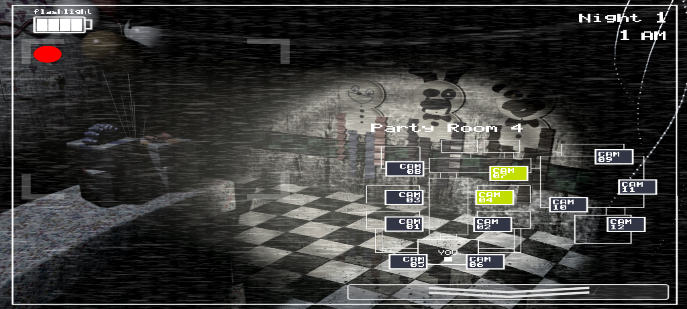

# Android release-7 source status

This is the canonical accuracy ledger for the project. The target is Pedro's
modern Android FNaF 2 release-7 build: Fusion build 296, project revision dated
August 2025. Community PC mechanics and strategies are useful leads, but a rule
enters the Android simulator only when the Android event sheet, an Android
experiment, or an explicitly labeled approximation supports it.

## The ledger is enforced by `tools/sourcetest.mjs` (2026-08-20)

A rule entering this ledger used to be an assertion about the engine that
nothing checked. The engine's other checks are population statistics —
`simtest` sweeps seeds, `bbtest` says the Minus 7 bot survives 200/200 — and
they pass or fail on aggregate survival, so a corrupted mechanism hides behind
a healthy outcome.

That gap is measured, not assumed. Ten sourced values were corrupted one at a
time and both suites run against each:

| | mutations caught |
| --- | ---: |
| `sourcetest` | **10 / 10** |
| `simtest` + `bbtest 200 --assert` | 2 / 10 |

The eight the old suite missed include `FOXY_AI` 17→15, `VENT_MASK_TICKS` 5→4,
`GF_HALL_KILL_FRAMES` 100→200, the night-7 mask fuse 45→90, Balloon Boy's route
losing a hop, and both input gates being deleted outright. Each of those is a
load-bearing sourced rule, and every one of them passed the whole engine suite.

`sourcetest` asserts the mechanisms directly against a hand-driven `Sim`, one
case per group citation, and runs first in `node tools/test.mjs --engine`. A
failure names the group rather than the symptom. **When a row in this ledger
changes, add or update its case there** — otherwise the row is documentation,
not a constraint.

## 2026-08-20: handle-scramble correction pass

The APK's runtime XORs every object handle with 28 at load
(`COI.loadHeader`); events address objects post-XOR. Every dump before
2026-08-20 therefore carried bijectively swapped object names — including
every Toy↔Withered pair — while all numeric constants (they live in event
parameters, not the item table) were unaffected. The dump has been
regenerated with true names; see `ANDROID-CAMERA-STALL.md` for the proof
chain.

Consequences for this ledger:

- **Corrected and re-verified:** the camera-light stall (400 frames from
  `stun time`, groups 450-457) is live; the look-hold (groups 344-348, 357)
  covers the Withereds and monitor-up Mangle, persists monitor-down via the
  parked marker, and Toys are ordered by Show Stage co-occupancy instead.
- **Name glosses now resolved:** `Multiple Touch`→`viewing`,
  `white button`→`lit?`, `old freddy` marker→`your view`,
  `chicalookatyou`→`office occupied`, `danger 2`→`being attacked by`,
  `monitorFrame`→`mask` (confirming the earlier inference), markers
  120/121/122/123→`hall stage 1`/`hall stage 2`/`in office`/`got you box`,
  `new bonnie` light latch→`viewing hall light`, `old chica` office
  latch→`in danger`, battery counter `cam 9`→`battery life`,
  fuse chain `stun time`→`mute call` is really `time allowed`→`time left`.
- **Re-derived and re-verified same day (2026-08-20, second pass):** the full
  route graph was re-extracted from the true-name dump (regenerated
  `route-graph.txt`) and the `STALLED` table rebuilt from it. Every start
  room, vent assignment, and the 4-7-10 flash cut-set match the real game
  and the corrected source: Withereds + W. Foxy start CAM 08 Parts/Service,
  Toys CAM 09 Show Stage, Mangle CAM 12, BB CAM 10, Puppet CAM 11; internal
  camera ids equal display CAM labels 1:1 (the old fitted 8↔9/4↔7/2↔1
  bijection is retired). Confirmed swaps now in the engine: the inverted
  monitor-DOWN final (plus the `right light` gate) is **Toy Bonnie's**; the
  1000-100*night opening cooldown and 500 ms office-cue roll are **Toy
  Bonnie's**; the six-tick opening arm is **Toy Chica's**; the `office
  occupied` mutex / cams-up streak four are **W. Freddy, W. Bonnie,
  W. Chica, Toy Freddy**; the hall-light-gated edges belong to WF/WB/TF/TC/
  Mangle/W.Foxy while **W. Chica and Toy Bonnie are exempt**. Independent
  validation: the Technical-FNaF wiki's "Minus 2 stalls Toy Bonnie and
  Withered Freddy at CAM 03" matches the corrected routes (TB's first hop
  and WF's second hop are CAM 03); the old table had neither. All engine
  suites pass on the rebuilt model (bbtest 200/200, androidstalltest sourced
  200/200 + 100/100, simtest scenarios re-bound and green).
- **Subsystem re-reads completed in the 2026-08-20 backlog sweep:** Foxy,
  BB, Puppet/music box, Paper Pals, forcedown queue, vent lights, and most
  of Golden Freddy — findings recorded in the extraction backlog below.
  The `ANDROID-OFFICE-ENDGAME.md` prose rewrite is done (item 19); still
  open: the hall-GF kill-threshold group, same-frame input ordering (item 7)
  and the display-map artwork closure (item 23).
- **The dump is reproducible on this machine (2026-08-20).** The extracted
  `application.ccn` plus a CTFAK build carrying our own `EventTextDumper`
  regenerate the true-name event sheet locally in about six seconds; see
  [`SOURCE-DUMP-GUIDE.md`](SOURCE-DUMP-GUIDE.md) and `tools/dump/`. Group
  numbering matches the citations already in this ledger. Item 7 (same-frame
  ordering) is therefore answerable here; item 23 still needs image export,
  which this logic-only dumper does not do.

## 2026-08-20: coverage, measured

Every pass before this one was a targeted lookup: it answered its own question
and said nothing about what had not been read. `tools/dump/coverage.py` now
classifies all 1332 office-frame groups by what they can change and diffs that
against every group number cited in the repo. Current state: **72% of the
state-writing groups and 86% of the input groups are cited**, with 87 unread
groups that could in principle move something, clustered into 19 blocks. The
full map is [`ANDROID-GROUP-MAP.md`](ANDROID-GROUP-MAP.md); regenerate it after
each sourcing pass.

Running down the two largest blocks immediately paid for the exercise:

- **`g875-881` — `hall movement`.** Any hall-routed character overlapping it
  sets it to 300 frames and g881 drains it. g779 requires it at zero, so for
  five seconds after anyone transits the hallway Golden Freddy cannot
  accumulate exposure there at all. Flagged as unmodelled during the Golden
  Freddy pass; now implemented.
- **`g458-477` — inert.** A per-character drain of the `C` counter. Nothing
  anywhere gates on `C` except the Puppet's branch selector (g406/407), so it
  is bookkeeping, not a mechanic.

That is the honest shape of the risk: not zero, bounded, and now enumerated.

## 2026-08-20: same-frame input order, and the forcedown the engine never had

Group order *is* the input order. Every group that reads a touch and writes
player state, in sequence:

| Groups | What |
| --- | --- |
| 16-27 | camera selection (`viewing`) |
| 75-89 | the flashlight (`lit?`) — hall needs `mask` = 0, `in danger` = 0 and no BB at 123 |
| 254-258 | the monitor button (`flip panel button` → `mmonitorUp`) |
| **262** | **forcedown executes on the monitor**: lowers it and zeroes `viewing` |
| 267-270 | the mask (`mask` → `mmaskOn`) |
| **274** | **forcedown executes on the mask**: takes it off |
| 301-320 | the vent lights |
| 612 | the forcedown flag is cleared |
| 614-619 / 624 / 718-721 | …and re-set, so it is always spent one frame later |

The ordering has a real consequence: a monitor press and a mask press made in
the same frame as a forcedown are both undone — the monitor before the mask
press is even read, the mask immediately after.

**`drop everything` was decoded in the earlier sweep but never implemented.**
It is set every 10 s while W. Freddy, W. Bonnie, W. Chica or Toy Freddy waits
at marker 122 **with the cameras up** (g718-721), on any attack start (g624),
and by the Puppet reaching 123 (g574). So the game slams the monitor down and
rips the mask off while one of the four is queued at the threshold. Minus 7
never sees it — the four are stun-locked and never reach 122 — which is why
its absence went unnoticed, but it is a live mechanic for every other line of
play and for recovery after a lapse.

## 2026-08-20: the office encounter, end to end

The shared encounter is five counters and one strict priority list.

| Group | Rule |
| --- | --- |
| 528/529 | `time allowed` = 50 frames on night 6, 45 on night 7+ |
| 530 | `in danger` goes above zero → `time left` = `time allowed`, `got you stage` = 1 |
| 531 | `time left` counts down per frame |
| 533 | mask reaches fully-on while stage is 1 → **stage 0, defended** |
| 532 | `time left` hits zero while stage is 1 → **stage 2, failed** |
| 534-536 | the `blackout` object plays the ~300-frame visible sequence either way |
| 537 | that sequence ending raises `check and move` |
| 538-555 | the resolution table: first match wins and zeroes `check and move` |

**One occupant resolves per encounter.** That is the queue pacing the ledger
was missing: with three of the four stacked at marker 122, defending clears
exactly one of them and the rest stay queued for the next encounter. Which one
is decided by group index, not by who triggered the encounter:

- defended (stage 0): **W. Freddy → W. Bonnie → W. Chica → Toy Freddy → Toy Bonnie → Toy Chica**
- failed (stage 2): **W. Freddy → W. Bonnie → W. Chica → Toy Bonnie → Toy Chica → Toy Freddy**

Toy Freddy swaps ends between the two halves — he is resolved before the two
toys on a success and after them on a failure. Defended occupants go to the
rooms the engine already used (WF CAM 08, WB CAM 07, WC CAM 04, TF CAM 09,
TB CAM 03, TC CAM 07) with `B = Random(500)/night`.

Mangle is **not in the table at all**, which answers the other half of the
question: she never joins the shared queue, because her 122 edge is the
private raise pair g402/403.

The engine resolved whichever unit started the encounter. It now applies the
sourced priority, so a queue drains in the real order.

## 2026-08-20: Golden Freddy, both of him

The office figure (`yellowbear`) and the hallway one (`golden`) are separate
objects with separate rules, and both are now fully in the ledger:

| Group | Rule |
| --- | --- |
| 336 | office spawn: 5 s interval, `viewing > 0` **and the raise finished**, `Random(20) < Golden Freddy AI`, none already present |
| 830 / 804 | that AI is capped at **10** (the others cap at 15), and is zero below night 6 — so 10/20 is exactly a coin flip |
| 776 | mask fully on → he dims and stops counting |
| 777 / 778 | starting a monitor raise, or the hall light latch, with him present → `got you box` |
| 781 | hallway: every one-second event **with the hall light off**, `golden` v1 = `Random(10)`; v1 = 1 is the frame that draws him (g203/204) |
| 779 | exposure +1 per frame while the light is on him and no one is at `hall stage 1`/`hall stage 2` |
| 780 / 865 | above 100 → kill; not present → counter zeroed |

Two corrections fall out. The hallway roll is **1 in 10**, not 1 in 11, and it
is **re-rolled every second rather than latched** — holding the hall light
freezes whatever is there, which is why he seems to "stay" while you look.
And the `[CALIBRATED]` "unfair raise" window is gone: g336 requires the raise
to have *finished*, so there is no 0.3 s bug to model. g779's empty-hall test
names exactly the characters routed through markers 120/121, which the engine
already calls `blindA`/`blindB`, so that condition is now exact rather than an
approximation over CAM 07.

## 2026-08-20: no mask storage — the counter resets on every re-mask

`v12` is incremented once per one-second event while `mask` = 2 (g907) for Toy
Chica, Mangle **and** Balloon Boy, and g294 forces BB back to CAM 10 at
`v12 >= 5`. The reset is g293, whose second condition is the system "only one
action when event loops" — so entering the fully-on mask state zeroes the
counter once, every time.

Two consequences:

- **No storage.** The community "mask storage" cycle (chudbud / Regi 2025,
  `MINUS-7-STRATEGY.md` §8) banks unused mask time across separate flicks. For
  the three vent occupants this build does not: the five ticks have to happen
  inside one continuous hold. The engine's cumulative `MASK_LEAVE_FRAMES` path
  for BB was the last surviving piece of that abstraction and is now replaced
  by the same per-tick counter Toy Chica and Mangle already used.
- **The hold is shorter than five seconds.** Five ticks span four boundaries,
  so a hold that goes fully on just before a whole second clears him in a
  little over **4.0 s**; the worst phase is just under 5.0 s. Any defence
  budget built on "five seconds of mask" is up to a second pessimistic.

## 2026-08-20: the mask kills every office light

`lit?` is set by g75 (hall, `viewing = 0`) and g84 (its touch twin), and both
require `mask` = 0; the vent-light clicks (g302/304) carry the same condition.
The camera light (g76/77/85/86) has no mask condition because the mask and a
raised monitor are mutually exclusive anyway. So on this build **a masked
player can do nothing but take the mask off** — there is no holding the light
through a mask.

That contradicts the PC Phase B technique quoted in `MINUS-7-STRATEGY.md` §6
("keep CTRL held: the flashlight costs no power while the mask is on"). The
engine had modelled the *power* half of that claim and not the effect; it now
gates `hallLightOn`, `lightLogical` and `anyOfficeLightHeld` on the mask being
off. Consequence for any Balloon Boy defence: the five-second mask window is a
five-second hole in Foxy cover, which is exactly why Markiplier's variant
evicts Foxy before letting BB arrive (§9.3).

## 2026-08-24: `mask = 0` means the animation, not the press

The section above gated the lights on "the mask being off". The dump is
stricter than that, and the difference retimes the cycle.

`mask` is a four-state animation counter, not a flag: **0** off, **1** raising
(g267/g270 on the press), **2** fully on (g9, at mmaskOn frame 12), **3**
lowering (g274). It returns to 0 only at g11, behind g10's "mmaskOff frame
>= 14" — so *the post-mask flash lockout is the mask-off animation itself*
(`MASK_ANIM_OFF`, 15 frames). Taking the mask off does not restore the light;
finishing the animation does. This is `VENT-CAMP-STRATEGY.md` §4 gap 6, and its
own parenthetical called the consequence correctly: it "matters for the
mask-off -> Foxy-flash beat the cycle depends on."

It does, because Foxy's reset runs through the same flag: **g489** (`viewing`
= 0, `battery life` > 0, `lit?` = 1 -> `viewing hall light` = 1) feeds
**g745** (Foxy at marker 120 + that latch -> D = 0, exposure += 1) and **g855**
(the B = 50 hall pin). A hall flash inside the lockout resets nothing at all.

Three more conditions on the same groups, all previously unmodelled:

- **`in danger` = 0** gates every light — g75 (hall), g76/g77 (camera) — and
  g83/g88 mean the flashlight hitbox does not even register the touch. The
  latch is raised by g443-447/g490 (an office encounter starting) and cleared
  by the endpoint resolutions g538-555, so it is exactly the engine's blackout.
- **The vent lights are re-tested every frame.** g299 clears both on a 200 ms
  timer and only g301/g303/g320 re-assert them, each requiring `mask` = 0 and
  `viewing` = 0. A vent light already held therefore goes out the moment the
  mask starts going on — so Toy Bonnie's g428 stall reads the light, not the
  finger.
- **The mask press needs `being attacked by` = 0** (g267/g270): once a
  marker-123 occupant has started its 40-frame attack, the mask no longer goes
  on. g560-562 set that counter per unit.

**Measured consequence.** Only the first of the four costs anything: with the
lockout implemented, the shipped Minus 7 cycle's hall flash (3 frames after the
mask-off tap) never lights, and `bbtest` falls 200/200 -> 0/200, every loss to
Foxy with D at 14. The other three gates are free — the reference bot is
unchanged by them.

The cycle is recoverable, but only by respecting the rule in two places:

1. the cycle's `hallDelay` must be >= `MASK_ANIM_OFF` (it was 3), and
2. `bbtest`'s `recover()` must wait out the mask-off animation before raising.
   It holds the light continuously through the attack, so those frames are the
   pass's Foxy reset; raising early spends them with the monitor already up,
   where the same held light is the *camera* light and D is never zeroed.

With both, `bbtest` is 200/200 again. The retimed cycle is materially tighter
than the old one (min box ~1%, min power 1528 vs 2976), so the published
per-step windows in `MINUS-7-STRATEGY.md` and the trainer's `CYCLE_SCRIPT` are
re-derived from a `cyclesearch` pass rather than by moving one knob.

`sourcetest` covers all four gates (g10/g11, g489/g745, g75/g76/g77, g299/g303/
g320, g267/g270): 118 -> 130 cases.

## 2026-08-20: Balloon Boy approach pipeline, re-sourced

Prompted by a strategy claim that keeping the cameras down across the 5 s
boundary *prevents* BB's last move. The event sheet says it defers it:

| Group | Rule |
| --- | --- |
| 342 | Every 5000 ms, `Random(20) < Balloon Boy AI` → `A = 1`. **No monitor, camera or light condition** — the roll is never blocked |
| 359 | `A = 1` and `B = 0` → `A = 2`, `C = 10` (look-hold row already in `ANDROID-CAMERA-STALL.md`: BB has no camera exclusion) |
| 413-416, 418 | `A = 2` + current marker → hop, `A = 0`. Route is **CAM 10 → 07 → 03 → 01 → 05**, no monitor gate anywhere |
| 417 | `A = 2` + on `cam 5` + `viewing > 0` + monitor-up complete → `in office` (122) |
| 290/291 | at 122, raise seen → `v6 = 1`; raise completes → `got you box` (123) |
| 292/294 | at 122 + mask fully on: 10%/s roll, or `v12 >= 5` consecutive ticks → back to `cam 10` |
| 907/293 | `v12` counts fully-masked seconds for Toy Chica, Mangle and BB; re-entering the mask state resets it |

**He is five moves away, not four, and the first one is silent.** Only
g414-416 write his vocal selector (`cam 01` v6 = `Random(3)+1`, played and
re-rolled by g608-611 from samples 21/24/23); g413 (CAM 10 → 07) writes
nothing, and g417 plays only sample 17, the movement thud *every* character's
hop shares (g691-694). So the community's "three laughs then he is in the vent
camera" counts his 2nd, 3rd and 4th moves, and his 5th is the one that needs
your cameras up. The engine previously modelled four moves, making him arrive
sooner than the real game. The vocal is picked at random per move — it does not
depend on which camera he is on. His in-office taunt is a **different** sample
(16), played on every input he blocks while at 123: flashlight key (g78),
flashlight hitbox (g88), the vent-light clicks (g302/304), and g311.

`A = 2` is a **latch, not a moment**: only group 417 gates on the monitor, and
nothing clears the latch while the cameras are down, so a cameras-down 5 s
boundary postpones the hop into the vent opening until the next completed
monitor raise — which the music box forces you to perform. This confirms the
engine's `bb.pending` model (`src/engine.js`) rather than the "cams down = no
move" reading in the community write-ups; see `MINUS-7-STRATEGY.md` §6.

## 2026-08-24: every sound in the Office frame, and who can claim it

Gate 0 of the [on-device audio-cue controller plan](../../plans/08-audio-cue-controller.md)
asks one question: does any cue uniquely announce a state edge? Frame 3 has 40
distinct sample handles across 161 play actions. `readdump.py sounds 3` indexes
them; the answer for the edges the controller cares about is mostly *no*, and
that removes a planned action from scope.

### Sounds are played through a register bank, not directly

Almost no group calls "play sample" itself. They write a value into an
alterable on the `cam 01` object, and a small bank of dispatch groups turns
that value into a sound:

| Register | Dispatch | Samples | Written by |
| --- | --- | --- | --- |
| `cam 01` v6 | g608-611 | 21, 24, 23 (v6=4 re-rolls) | BB hops 2-4 (g414-416) |
| `cam 01` v21 | g691-694 | 17, on any value 1-4 | 18 groups, see below |
| `cam 01` v5 | g704-708 | 25-29 | 8 characters at marker 149 `hear footsteps` (g695-702) |
| `cam 01` v12 | g709-711 | 30-32 | Toy Foxy only (g703, g741) |

Reading only the play actions hides this indirection completely, and it is the
reason a naive pass concludes that BB's departure is silent. It is not.

### Sample 17 is the movement thud, and 18 transitions fire it

`writes 3 "cam 01" 21` lists every writer. Excluding the four dispatch groups
that reset the register:

| Group | Edge |
| --- | --- |
| 292 | **BB mask-clear, 10%/s roll at marker 122** |
| 294 | **BB mask-clear, forced on the 5th masked tick** |
| 387 | W. Chica hop to CAM 2 |
| 400 / 401 | Toy Foxy mask-clear, roll and forced |
| 416 | BB hop 4, CAM 01 → CAM 05 |
| 417 | BB hop 5, CAM 05 → office, the monitor-gated edge |
| 439 / 440 | Toy Chica mask-clear, roll and forced |
| 685-690 | W. Chica, W. Bonnie, Toy Bonnie, W. Chica, Toy Foxy, Puppet arriving at CAM 5/6 |
| 739 | Toy Foxy at 123, 5%/s |
| 748 / 749 | W. Bonnie and W. Chica at 123 while masked, 10%/s |

Seven characters share one sample. Worse for the plan's highest-payoff idea:
g292/294 (BB leaving) fire under the *same* `mask fully on` condition as
g400/401, g439/440, g748/749. While you sit masked waiting for BB to go, four
other characters can produce a byte-identical sound.

### The Balloon Boy pipeline, sound by sound

| Group | Hop | Sound |
| --- | --- | --- |
| 413 | CAM 10 → 07 | **silent** |
| 414 | CAM 07 → 03 | vocal 21/24/23, channel 14 volume 25 |
| 415 | CAM 03 → 01 | vocal 21/24/23, channel 14 volume 25 |
| 416 | CAM 01 → 05 | vocal 21/24/23 **and** thud 17 |
| 417 | CAM 05 → office (122) | thud 17 |
| 607 | on arrival at 122, once | sample 21 |
| 292 / 294 | leaves 122 | thud 17 |

Two corrections to the 2026-08-20 entry above. g416 writes *both* registers, so
the third counted laugh arrives with a thud under it, and arrival at the
opening is a **pair** — thud 17 from g417 plus sample 21 from g607 — not a
single sound.

### Loudness is state, and it is why the vocals are hard to hear

Every vocal hop sets channel 14 to volume 25, so amplitude cannot separate hop 2
from hop 3 from hop 4. It does something more useful. The channel's start-of-
frame default is **50** (g60), the hops drop it to **25**, and one group raises
it to **60**:

| Group | Condition | Channel 14 volume |
| --- | --- | ---: |
| 60 | start of frame | 50 |
| 414-416 | BB hops 2-4 along the route | **25** |
| 906 | BB at marker 126 `your view`, monitor up, every 5 s, `Random(20)=1` | **60** |

g906 is worth its own line: when Balloon Boy is on **the camera you are
currently watching**, he has a 5%-per-second chance of vocalising, and the game
plays it at more than twice the volume of an approach hop. So the same three
samples carry two different meanings, and level is what separates them —
quiet means "he moved somewhere on his route", loud means "he is on the feed in
front of you".

That has a direct cost. Approach vocals — the ones a controller actually needs
— are played at **half the channel default**, which is why a 285-second
device recording over several pilot runs produced no vocal detection above
threshold while the shared thud (played by every character's hop) reached 0.606.
Best scores over that recording: sample 17 **0.606**, sample 21 0.486, sample 23
0.437, sample 24 0.347, against per-sample p99 background of 0.476/0.367/0.335/
0.249. The cue is quiet by design, not missing by accident.

It also indicts the detector's own design. `tools/cue/features.py` removes each
frame's mean precisely to be level-invariant, which is right for robustness to
capture gain — and which throws away exactly the quantity that separates
`your view` from a route hop. A detector that wants both must carry a separately
calibrated level feature beside the shape score.

### Uniqueness verdict

| Sample | Groups | Unique to one edge? |
| --- | --- | --- |
| 23 | 610 | **Yes** — the only sole-trigger BB vocal |
| 21 | 607, 608 | No, but both triggers are BB |
| 24 | 609, 743, 814 | No — also Toy Foxy at 123 and BB at 123 |
| 17 | 691-694 | No — 18 edges, 7 characters |
| 25-29 | 704-708 | No — `Random(5)+1` shared by 8 characters incl. BB |
| 30-32 | 709-711 | Toy Foxy only |

BB's own footstep sound at marker 149 is `Random(5)+1` from the same bank the
other seven draw from (g702 is identical to g695-701), so there is no unique
BB vent cue either. Toy Foxy is the only character with a private bank.

### What this costs the plan — and what it does not

The sample is shared. Whether that makes it *ambiguous* is a question about the
run, not about the game, and the answer differs.

**In the general case, early unmasking is out.** An unmask rule keyed on sample
17 would fire on Toy Chica's or Mangle's departure while BB is still at 122,
which is the exact error plan 08 calls unacceptable.

**Under Minus 7 it is not ambiguous at all.** Cross the thud's sources against
the strategy's roster and the overlap vanishes:

| Thud source | Groups | Minus 7 |
| --- | --- | --- |
| Balloon Boy | 292, 294, 416, 417 | **not stalled — the whole difficulty of the strategy** |
| W. Chica | 387, 688, 749 | stun-locked all night |
| Toy Chica | 439, 440, 685 | stun-locked all night |
| Mangle | 400, 401, 689, 739 | stun-locked all night |
| W. Bonnie | 686, 748 | stun-locked all night |
| Toy Bonnie | 687 | stun-locked all night |
| The Puppet | 690 | only leaves CAM 11 if the music box empties |

[`MINUS-7-STRATEGY.md`](../strategy/MINUS-7-STRATEGY.md) keeps **seven of the
ten permanently stun-locked**, leaving W. Foxy, Golden Freddy and Balloon Boy —
and neither W. Foxy nor Golden Freddy writes the thud register at all. Every
other writer is either one of those seven or the Puppet, whom a wound box keeps
in place.

So while the stalls are current and the box is wound, **a vent bang is Balloon
Boy**, and it is the *loud* cue: the thud plays on channel 15 at volume 50,
where his vocals play on channel 14 at 25. This is exactly the case plan 08's
controller semantics anticipated — "use a shared thud only as corroboration of a
transition that controller state already makes possible" — and the controller is
the thing maintaining the stalls, so it can assert that state rather than assume
it. A lapsed stall breaks the uniqueness, which is precisely why it has to be
asserted per-decision and not once per night.

The approach cues survive, with a condition. Samples 21/24/23 are jointly
diagnostic of a BB hop **given controller state**, because every non-BB
trigger for 21 and 24 requires someone to be at 122/123 — states the
controller already tracks. That is corroboration, not identification, and it
is what the surviving "vocal arms a lit CAM-05 visual check" architecture
already assumed.

### The simulator has been reading a field the phone cannot hear

`src/engine.js` emits `vent-bang` with a `who`, and two controllers consume it:
`tools/minus6test.mjs` counts threats with `e.data?.who !== 'bb'`, and
`tools/hidpilottest.mjs --vocal-cam5` resets its vocal count on
`who === 'bb' && leaving`. The source says every one of those events is sample
17. No audio detector can recover `who`, so both controllers are using a sensor
that does not exist.

This does not rescue or sink the §4 rejection of the counted-vocal controller —
that policy was already rejected — but it means the 3,000/3,000 perfect-vocal
upper bound is unattainable for a second, independent reason, and any future
policy must derive identity from controller state rather than from the cue.
The events now carry a `sample` field so a controller can be held to what the
phone can actually hear.

## 2026-08-26: the office pan is sourced, and no game rule reads it

Package 0 of the [stock-device controller plan](../../plans/10-stock-device-controller.md)
asked whether the exact simulator needs a pan state. The event sheet answers it
completely, and the answer splits in two: **the pan is fully sourced as a
mechanism, and it is read by nothing in the game.**

### The mechanism

The office view position lives on one object, `camera follow 2` (event handle
80), and it is the *display scroll*, not a camera selection:

| Group | Rule |
| --- | --- |
| 252 | `viewing = 0` → set the display X to `camera follow 2`'s X. Unconditional every frame the monitor is down |
| 73 / 118 / 121 / 175 | the monitor-up views scroll from `camera follow` (73) or are pinned to X = 0 — a separate carrier |
| 228 | start of frame: `camera follow 2` v18 = 0, **v23 = 512** |
| 247 | every frame: `v23 = Max(512, Min(1088, v23 + v18))`, then X := v23 |

So the pan is an integrator with a **clamped range of 512-1088 — 576 units of
travel — and the office opens at 512, the minimum end.** [SOURCED] The whole
range is one-directional from rest. (`A -3 num=8` taking a single X parameter
reads as "centre display at X"; with a 1024-wide virtual screen that implies a
1600-wide office. The 1024 width is confirmed below; the office width is
[INFERRED].)

The Android drive is a **hold-at-edge**, not a drag and not a fling: [SOURCED]

| Group | Rule |
| --- | --- |
| 235-238 | a new touch sets a global to 0, +1 if it is over neither `hudFlashlightHitbox` nor `muteButtonHitbox` (236), +1 if it is over none of `honk`, `lightLeftHitbox`, `lightRightHitbox` (237). **Only at 2** does group 238 claim it as the pan touch (`Multiple Touch` v4) |
| 240 | parent: the pan touch exists and its Y < 688. Computes `Multiple Touch` v3 = `XTouch(v4) - XLeftFrame`, i.e. the touch's **screen** X |
| 241-243 | v3 < 290 / < 240 / < 180 → `camera follow 2` v18 = **-8 / -17 / -25** × the frame-delta scale |
| 244-246 | v3 > 734 / > 784 / > 844 → v18 = **+8 / +17 / +25** × the same scale |
| 229 | v18 = 0 **every frame**, before 241-246 run |
| 230 | v18 = 0 and the pan touch is released when the monitor is up during an attack |

Group 229 is what makes it a hold: the velocity is recomputed from the current
touch position each frame and there is **no inertia and no snap target**. The
thresholds are symmetric about 512, which fixes the virtual screen at **1024
wide**; the pan band is the outer ~28% of each side, above Y = 688. [SOURCED]

The multiplier is the frame-delta scale group 1236 writes as
`Min(4, frameDelta/16.666)`, so the pan is **frame-rate compensated**: the
*distance* is frame-rate independent, the *wall clock* is not, and a tick longer
than 66 ms under-scrolls against the clamp. At 60 fps a full 576-unit traverse
is **384 ms** in the fastest band, 565 ms in the middle, 1200 ms in the outer
band. [INFERRED — sourced constants, assumed 60 fps]

### Nothing reads it

An exhaustive scan of frame 3 for every reference to handles 80 and 73 — `OI`,
`ParamObject`, `Position`, and the `oi=` inside expression items — returns only
the groups above plus g220-225 (the PC mouse edge-pan and its X > 500 / X < 1100
bounds), g624 (an attack stops the pan) and g1231 (below). **No light, vent,
attack, animatronic, battery or timer rule tests the view position.** [SOURCED]

In particular the three office lights are **unconditional with respect to pan**:

| Light | Android group | Its whole condition set |
| --- | --- | --- |
| left vent | **313** | the touch tracked in `Multiple Touch` v0 is over `lightLeftHitbox`; `viewing = 0`; `mask` v0 = 0; no BB at 123 |
| right vent | 320 | the same with v1 and `lightRightHitbox` |
| hall (`lit?`) | 83-86 | the touch tracked in `hudFlashlight` v0 is over `hudFlashlightHitbox`; `battery life` > 0; `in danger` = 0; then the `viewing`/mask/BB branch |

g301/g303 are the mouse equivalents of 313/320. **Group 313 is the Android left
vent light and was not previously cited** — the ledger cited g301/303/320 and
skipped it. None of the five has a view-position condition. [SOURCED]

So the source verdict is: **the exact simulator does not need a pan state as a
gate.** Adding one to `src/engine.js` would be inventing a rule the event sheet
does not have.

### But the vent lights are scene-anchored and the hall light is not

The gating is geometric, not logical, and the two kinds of button differ:

| Group | Rule |
| --- | --- |
| 1223 | start of frame: `lightLeftHitbox` and `lightRightHitbox` are positioned **onto** `left light` and `right light` — scene objects — and never moved again |
| 1072 / 1077 | `hudFlashlightHitbox` is created at an **absolute** position with no parent, on layer 4 (290,145) or layer 3 (32,96) depending on the control-layout branch |
| 1226 / 1229 / 1230 | `honk`, `lightLeftHitbox`, `lightRightHitbox` are registered as `Perspective` zones 0/1/2. `hudFlashlightHitbox` never is |
| **1231** | those three zones are **re-registered whenever `camera follow 2` v18 ≠ 0** — that is, while the view is panning |

A hitbox that scrolls with the office cannot be touched when the pan has carried
it off screen, and group 1231 exists precisely because the mapping has to be
rebuilt as it moves. So the vent lights are pan-dependent **in screen space**
while the hall light is not. [SOURCED for the groups; [INFERRED] for the
conclusion, which the placements below would make [SOURCED].]

Two consequences follow from groups already in the ledger:

- **A held vent light does not survive a pan.** g299 clears both vent lights on
  a 200 ms timer and only g313/g320 re-assert them, each requiring the tracked
  touch to still be *over* the hitbox. g308/g315 drop the tracked touch id the
  moment it is not. A stationary finger loses the hitbox as the view moves, and
  the light is out within 200 ms. [SOURCED]
- **A pan does not block other input.** The pan touch (`Multiple Touch` v4), the
  two vent-light touches (v0, v1) and the flashlight touch (`hudFlashlight` v0)
  are four independent slots, and g237 explicitly refuses to claim a touch that
  landed on a light hitbox. A second finger can hold the hall light, the mask or
  the monitor while a first finger pans — those hitboxes do not move. [SOURCED]

That last point also re-reads the two nights lost to panning. *"Started panning
view instead of flashing"* and *"fails to press hall light and moves the vision
instead"* are **not** the game preferring pan over press: g237 gives the button
priority. They are the finger **missing the hitbox** and landing in the edge
band, which is what an unclaimed touch there does.

### What the dump cannot say

*(Superseded 2026-08-26 by the section below — the dumper was extended. Kept
because its expectation was wrong in an instructive way: the instance list
exists and is readable, and it still does not answer the question.)*

`tools/dump/EventTextDumper.cs` emits logic only, so the **frame object
placements are not in it**: the scene X of `left light` and `right light`, their
hitbox sizes, and therefore the pan positions at which each is on screen are
`[UNKNOWN]` from this artifact. Closing it needs either an extension to the
dumper that emits the frame instance list (X/Y/layer) or a device measurement.

The nearest existing evidence is the in-engine precedent, not the Android
source. [`SHOOTER25-BOT-STATE-MACHINE.md`](../in-engine/SHOOTER25-BOT-STATE-MACHINE.md)
records that the Shooter25 practice mod drives **the same `camera follow 2`
object**, and that its embedded bot gates its own light actuations on it: left
light while `X <= 680`, right light while `X >= 910`. Because 680 < 910, **no
single pan position actuates both vent lights** and the bot pans between them.
That is a modified PC build (Fusion 295, XOR 0) with its own group numbering, so
for Android those two numbers are `[CALIBRATED]` at best — but the *shape* they
describe agrees with g228's rest-at-512: the office opens at one end of its
travel, so the two vents are not symmetric.

## 2026-08-26: the office is 1600x768, and the vent anchors contradict the phone

`EventTextDumper.cs` now emits each frame's size, layers and placed-object list
(`SOURCE-DUMP-GUIDE.md` §3). Stripping the new line types reproduces the old
dump byte for byte. Two results came out of it, one clean and one a conflict.

### The office frame is 1600 x 768, and that closes the pan arithmetic

Frame 3 `04-Office` is **1600 x 768, 9 layers, 205 placed instances**.
[SOURCED — frame header chunk]

The width was `[INFERRED]` above. It is now sourced, and it makes the clamp
exact rather than plausible:

```
frame width      1600
virtual screen   1024   (g241-246 thresholds symmetric about 512)
1600 - 1024   =   576
g247 clamp    =  [512, 1088]   ->  1088 - 512  =  576
```

The pan clamp is precisely *"do not scroll past the frame edges"*, and the two
numbers were derived from completely different chunks — the clamp from event
parameters, the width from the frame header. **[SOURCED]**

So the viewport at display centre `c` is scene X `[c - 512, c + 512]`:

| `camera follow 2` v23 | viewport in scene X |
| --- | --- |
| 512 (rest, the minimum) | `[0, 1024]` — the left edge of the office |
| 1088 (the maximum) | `[576, 1600]` — the right edge |

### The virtual screen is stretched to fill the phone, not letterboxed

Converting a scene X to a device coordinate needs the mapping, and the phone
already measured enough to pin it. The 1024x768 virtual screen is **stretched
to fill** 2400x1080 (non-uniformly — 4:3 content on a 20:9 panel):

```
physX = sceneX_on_screen * 2400/1024      physY = virtualY * 1080/768
```

Two independent checks, neither of which was used to build it: [CALIBRATED]

| Check | Predicted | Measured on the Moto g56 |
| --- | --- | --- |
| right pan band starts at virtual X 734 (g244) | phys **1720** | "no movement at x<=1700, pans at x=1800" |
| hall light held at phys (1200, 540) | virtual **(512, 384)** — dead centre of 1024x768 | the hall light is the centre-screen control |

A letterboxed (uniform-scale) mapping predicts 1182 for the first row and is
refuted by the same measurement.

### Where the vents are, and what the right one costs

Running the left vent's measured button through that mapping:

| Quantity | Value | Label |
| --- | --- | --- |
| left `LIGHT` at phys (350, 615) | virtual **(149, 437)** | [CALIBRATED] |
| left light scene X (rest, so scene = virtual) | **~149** | [CALIBRATED] |
| Shooter25's `X <= 680` gate implies scene X | ~168 | [CALIBRATED] |
| right light scene X, from Shooter25's `X >= 910` | ~1422 | [CALIBRATED] |
| right light scene X, by office symmetry (1600 - 149) | ~1451 | [INFERRED] |
| centre at which the right vent enters the viewport | **~939** | [INFERRED] |
| travel from rest to reach it | **~427 of the 576 units (74%)** | [INFERRED] |
| that travel, one way, at 60 fps | **285 ms** fast band / 419 ms / 890 ms | [INFERRED] |

The two independent estimates of the left light (149 from the phone, 168 from
Shooter25) agree within 19 scene units, and the right-vent pair within 29. At
maximum pan the left light sits at screen X ~ -427 — off screen — so **no single
pan position reaches both vents**, which is the shape Shooter25's `680 < 910`
already asserted. [CALIBRATED]

**The right vent costs ~570 ms of pan round trip at the fastest band**, before
the light is even held, against the roughly 680 ms the cycle has free. That is
the number plan 03's right-vent camp has to be priced against.

### The vent-light anchors contradict the phone, and that is the finding

The instance list does **not** corroborate any of the above. It places both
anchors off the frame entirely:

| Object | event / stored handle | scene X, Y | layer | scene box |
| --- | --- | --- | --- | --- |
| `left light` | 94 / 66 | **-276, 634** | 3 | x[-304..-246] y[592..680] |
| `right light` | 95 / 67 | **-276, 662** | 3 | x[-305..-247] y[620..708] |
| `honk` | 171 / 183 | 1, 1018 | 4 | x[-6..10] y[1011..1027] |
| `lightLeftHitbox.Active` | 200 / 212 | 225, -61 | 8 | x[217..233] y[-69..-53] |
| `lightRightHitbox.Active` | 201 / 213 | 273, -61 | 8 | x[265..281] y[-69..-53] |
| `hudFlashlightHitbox.Active` | 195 / 223 | **no frame-3 instance** | — | — |

Both anchors sit at the same X, 28 units apart vertically: an authoring park
stack, not a placement. And **nothing in the game moves them** — every
`Position: Object Info: h` and every `Create` parameter in all 33 frames was
scanned for handles 94 and 95, and the only hit is g1223 moving the *hitboxes
onto them*. [SOURCED]

Read literally, then, g1223 puts the vent-light hitboxes at scene X = -276,
where no viewport can ever reach them. The phone says the left `LIGHT` is
actuable at rest (scene X ~ 149, brightening the left vent region by +8.87
luma), and Shooter25 independently says ~168. **The two controls agree with each
other and both contradict the dump by roughly 425 units.**

The dump is not wrong about what it holds; it is wrong about what it means. The
instance list is the *editor's* placement, and the Android port lays out part of
its HUD from code:

- every mobile HUD object is parked on **layer 8 at negative Y** in a neat row —
  `hudFlashlightCorner` (137,-101), `hudFlashlightText` (137,-61),
  `lightLeftHitbox` (225,-61), `lightRightHitbox` (273,-61), `lightsRight`
  (193,-85) — the signature of an off-canvas prefab strip; [SOURCED]
- `hudFlashlightHitbox.Active` has **no frame-3 instance at all**, yet g1072-1081
  create objects positioned relative to it. Something outside the event sheet
  must instantiate it. [SOURCED]

So: **a placed position in this dump is not evidence of a runtime position for
any mobile HUD or interaction object.** [SOURCED for the placements and for the
absence of any repositioning event; [INFERRED] for the runtime-layout
explanation.] The scene X of the vent anchors stays `[UNKNOWN]` from the source;
the reachability answer above stands on the phone and Shooter25 instead, and the
1600 width — which the scene art *does* corroborate — is what made it derivable.

## 2026-08-26: the double-camera glitch *does* transfer — `viewing` and `your view` can disagree

**This section retracts backlog item 8 below.** From 2026-08-20 that item said
"no such state exists in the Android data model: one `viewing` counter, one
marker, set atomically per touch (group 40)". The first half is right about a
single *touch*; the conclusion drawn from it is wrong, because a touch is not
the only writer of `viewing`. Two fields carry the camera selection, and one
event path moves them apart. The original text is kept in place, struck through.

### What forced the re-read

A retained on-device classifier frame from the cleared Night 1 shows **two
camera buttons highlighted lime at once**.



| | |
| --- | --- |
| Run / session | `n1-full-1640` / `n1-full-1640-20260826T191856Z-aab8b590`, 2026-08-26 |
| Device / build | moto g56 5G, `com.scottgames.fnaf2` **2.0.7+26** |
| Sensor | `screencap-raw`, 2400x1080 RGBA_8888 (the retained `.raw`, rendered losslessly to the PNG above) |
| Clock / offset | `runner_monotonic_ms` **92879 ms**, Night 1, in-game **1 AM** |
| On screen | picture and room label = **Party Room 4 (CAM 04)**; **CAM 04 and CAM 07 both lit** |

**Control, because a favourable blob is not two buttons.** Under the saturated
predicate `r>150 & g>150 & b<110`, sampling every 2nd pixel, the frame has 2165
lit pixels in **two disjoint boxes** — x 1668-1788 / y 668-712 (**1101 px**, the
CAM 04 tile) and x 1716-1838 / y 584-628 (**1064 px**, the CAM 07 tile). A
single lit button measures **1064-1157** under the same predicate across all
twelve cameras, so each cluster is exactly one button. It is not one enlarged
highlight and it is not the classifier over-reading green.

`captures/n1-full-1640.mp4` **cannot** settle this and should not be tried
again: it is 1280x576 H.264, and its maximum yellowness (`min(r,g) - b`)
anywhere in a 10-sample scan across the run is 93 against 194 for the same
button on the raw sensor. Chroma subsampling crushes the lime below
separability.

### The mechanism, from the event sheet

The camera selection is **two fields**, and every consumer picks one of them:

| Field | What it is | Read by |
| --- | --- | --- |
| `viewing` (counter, handle 55) | which camera the *UI* thinks is up; `0` = monitor down | the camera picture (`views.Active` frame, g98-198), the room-name label (`Active 14`, g46-57), the button highlight (g46-57), the flash **immunity** gates `viewing <> 8 / <> 9 / <> 11` (g450-457), the Puppet's held-light block `viewing == 11` (g494/495) |
| `your view` (Active marker, handle 126) | which camera *marker* the player is parked on | the flash **target** — `your view` overlapping the character (g450-457), the marker look-hold cam-stall (g344-348 Withereds, g357 Mangle), the Puppet's camera interference (g498) |

Writers, from an exhaustive scan of all 1332 groups of frame 3:

| Group(s) | Writes |
| --- | ---: |
| 16-27 (mouse click on a `cam NN`), 39 + 40 (touch release on `cameraHitbox`) | `viewing = N`, `your view` → that marker, **and** `cam 01`.AlterableValue0 = 1 — the three together, only here |
| 45 | `cam 01`.v0 == 1 → clear the latch and set **all twelve** button tiles to the unlit frame |
| 46-57 | `viewing == N` → set that one button tile to the lit frame, and the room label |
| 262 (monitor down), 911 (mask fully on) | `viewing = 0`. **Marker not moved, latch not set** |
| 263 | `viewing > 0` **+ Every 200 ms** → `last viewed = viewing`. The *only* writer of `last viewed` |
| 1 → child 2 | on monitor-raise completion (`mmonitorUp.v0 >= 12`, "only one action when event loops"): `viewing = last viewed`. **Marker not moved, latch not set** |
| 3, 4, 486, 487 | the frame-start / first-raise defaults, which *do* move the marker in step (CAM 09, or CAM 07/10 on night 7) |

Two consequences follow directly:

1. **`last viewed` is sampled, not written through.** Group 263 copies `viewing`
   into it on a 200 ms timer, so it lags the live selection by up to 200 ms.
2. **The raise restores `viewing` from that stale copy and never touches the
   marker.** So: select camera X, then drop the monitor before 263's next tick.
   `last viewed` still holds the previous camera Y. On the next raise
   `viewing = Y` — the picture, the label and the immunity gate all say Y — while
   `your view` is still parked on **X**.

The double highlight is not a separate rendering bug; it is the *tell* for that
state. Group 45 is the only clearer and it fires only on the touch latch, so
X's button — lit by g46-57 while `viewing` was X — is never cleared, and Y's
button lights beside it. Because g2/g3/g4 are the only `viewing` writers that
skip the latch, and g3/g4 move the marker in step, **two lit buttons implies
`viewing` ≠ `your view`**, with the freshly lit tile naming `viewing` and the
stale one naming the marker. That is exactly the observed frame: `viewing = 4`
(Party Room 4 on screen, CAM 04 lit) with the marker parked on `cam 7`.

It also **persists**. After the raise, g263 resamples `last viewed = viewing`,
so further monitor cycles preserve the pair; only the next camera *touch*
re-syncs the marker and clears the highlights. That matches the PC accounts'
"the glitch persists and is re-armed once".

### Why this is not cosmetic

Groups 450-457 read the two fields **in different roles in the same group** —
`your view` overlap picks *who* is stunned, `viewing` supplies the *immunity*:

```
GROUP 453   your view overlapping [new freddy]  +  viewing > 0
            +  lit? = 1  +  viewing <> 9          →  new freddy.B = stun time
```

So parking `your view` on `cam 9` while `viewing` is anything but 9 stuns Toy
Freddy, Toy Bonnie and Toy Chica (g453/454/455) through a held flashlight —
**the CAM 09 immunity is bypassed**, which is the whole payoff of Minus Toys.
The same holds for `cam 8` and the three Withereds (g450-452, gate `<> 8`) and
for `cam 11` and Mangle (g456, gate `<> 11`). And with `viewing == 11` the
Puppet's escape-stage roll is still blocked by the held light (g494), so the
glitched flash and the box-hold stack in one hold — the published routine's core.

The marker look-hold cam-stall (g344-348, g357) also reads `your view`, so the
parked marker keeps stalling its room while a different camera is displayed.

### What is sourced, what is inferred, and what is still open

**[SOURCED]** — the field split, every writer above, the flash groups' split
read, the Puppet block's `viewing == 11`, and the exhaustive result that
**nothing in frame 3 reads the button highlight back** (the only condition
anywhere in the frame that addresses a `cam NN` object as its subject is g45's
`cam 01`.v0 test; every other `cam NN` reference is a position-overlap
parameter).

**[INFERRED]** — two glosses the dump cannot name, per
[`SOURCE-DUMP-GUIDE.md`](SOURCE-DUMP-GUIDE.md) §3 ("no condition/action name table"):

- `A 17` is read as "set the display frame". Control: the same action on
  `views.Active` (g98-198) is demonstrably what selects which camera picture is
  shown, and on `Active 14` what selects the room-name label.
- Group flag bit `0x8000` is read as "child event" and `0x40` as "has children",
  which is what makes g2/g3/g4 children of g1. Control: g83 has **`acts=0`** and
  is followed by three `0xA000` groups (g84-86) that set `lit? = 1`; at top level
  those would fire unconditionally every frame, which is impossible, so they must
  be gated by g83's flashlight-hold conditions — and g75-77 are the identical
  three cases with the *keyboard* condition written inline. Independently, g2
  cannot be top-level either: `last viewed > 0 → viewing = last viewed` firing
  every frame would make `viewing = 0` unreachable and pin every selection to
  `last viewed`.

**OPEN, and none of it is small:**

- **Deliberate arming has never been attempted on the device.** This frame was
  an accident inside a Minus 7 pilot run. The run's event stream records no
  presses, and the log shows only `macro attack[2..999]` at 87859 ms and
  `monitor` at 92039 ms before the 92879 ms snapshot, so the exact input that
  produced it is **not reconstructed**. The runner's own classifier flagged the
  frame `cams=UP-DESYNCED` at 93029 ms.
- **The real window is unmeasured.** The source says "before group 263's next
  200 ms tick"; what fraction of attempts land it through the phone's actuator
  is unknown. Price it against `HID-MULTITOUCH.md`, not against an ideal input.
- **No stun has been observed through a glitched marker.** The payoff above is
  read off the event sheet only.
- **The engine models none of this.** There is no double-camera state in
  `src/engine.js`, so no `sourcetest` case accompanies this section; it is a
  backlog finding, not an implemented rule. Implementing it is what would reopen
  Minus Toys as a *measurable* policy rather than a plausible one.
- The consecutive-tick mask-clear semantics that broke Minus Two
  (`MINUS-3-STRATEGY.md` §7) are untouched by this and still apply.

## 2026-08-26: who each control actually answers — the audit behind `elegance.py`

`tools/device/elegance.py` grades a run by asking, per input, whether the threat
it answers can act that night. Its table had already been wrong twice by naming
**one** animatronic for a control that answers several (the held-light sweep,
the vent read). Every remaining row was then read off the dump rather than off
its name. Three more were wrong the same way. None of the three moved a night's
figure — `canAct` kept the old class live wherever the row fires — so they were
**wrong models, not wrong numbers**, and nothing would have caught them until an
AI-table or route change made them wrong numbers silently.

**[SOURCED]**, frame 3:

| Control | What it answers | Groups |
| --- | --- | --- |
| Wind the box | the Puppet, and **only** the Puppet | `music button`.v0 is written by g638/639 (both gated `viewing == 11`) and read as a game rule only by g494/495, the escape-stage advance. Of 35 groups touching the object the rest are presentation: g633/634 show/hide, g597-600 + g662 sample choice, g664-671 the danger warnings |
| Select CAM 11 | the Puppet **and Mangle** | selecting writes both fields (g16-27, g39+40). `viewing == 11` gates the wind button (g633/634, g638/639) and, with the light held, blocks the Puppet's escape roll (g494 vs g495). The parked `your view` marker stalls Mangle: g357 promotes him only when the marker is *not* on him, and his route is cam 12 → **cam 11** (g391) → cam 10 → cam 7 → hall |
| Mask | **eight** characters, not the three Toys | repelled at `mask`.v0 == 2: Toy Bonnie g436/437, Toy Chica g439/440, Toy Freddy g213, Mangle g400/401, W. Freddy g378, W. Bonnie g748, W. Chica g749, Balloon Boy g292/294, Golden Freddy g776 |
| Mask, on **Withered Foxy** | makes him **worse** | g824 ticks his approach counter every 1000 ms; g825 ticks it a *second* time per second while the mask is fully on and nobody is at the vent opening |
| Hall flash | Withered Foxy **and Withered Freddy** | `viewing hall light` is written by g489 (monitor down + battery + `lit?`). g745 resets W. Foxy's v3 at hall stage 1, g864 decrements it every 500 ms on cam 8 — **and g848/g849 set W. Freddy's B to 40 at hall stage 1/2**, a stun that is not Foxy's |
| Hall flash, as a hazard | Golden Freddy, W. Foxy | g778 spawns Golden Freddy straight into `got you box` if he is visible when it fires; g573 kills through a W. Foxy already inside. This is the sourced form of the route's "clear Golden Freddy *before* you press CTRL" |

Two effects were read and deliberately **not** counted as services, with the
reasoning recorded on the rows in `elegance.py`:

- `viewing hall light == 0` is a precondition on the hall-transit hop of six
  characters (g376-378 W. Freddy, g381/382 W. Bonnie, g389/390 W. Foxy, g358 +
  g394/395/399 Mangle, g421/422 Toy Freddy, g431/432 Toy Chica). True, but it
  holds only while the light is lit and the route's pulse is ~130 ms of a
  ~5000 ms cycle. A block that expires with the pulse is not the same kind of
  thing as a latched counter reset, and counting it would make the hall row
  "needed" on every night and stop it discriminating at all.
- The monitor raise is transport, not a defence — but it is not free: it is what
  lets Balloon Boy cash his latch (g417) and step from the opening into the
  office (g290/291). A cost is not a threat answered.

**Not implemented in the engine**, and no `sourcetest` case accompanies this: it
is a grading-model correction, not a new simulated rule.

## Labels

- **Implemented** — Android source rule is represented and regression-tested.
- **Confirmed / pending implementation** — event rule is located, but the engine
  does not reproduce its full state machine yet.
- **Partially decoded** — relevant events are located but object identity, ordering,
  or counter meaning is incomplete.
- **Model-only** — useful approximation; not source evidence.

## Implemented Android mechanics

| Mechanic | Evidence / implementation status |
| --- | --- |
| Night clock and movement cadence | Global 1000 ms ticker, 70 ticks/hour, movement opportunity every 5000 ms |
| Movement RNG and the AI table | `Random(20)+1 <= AI`, with the Puppet's bare `<=` variant (g494-497). The per-night/per-hour levels are implemented 2026-08-23 from g673-684 (table), g787 (Custom Night dials), g804 (Golden Freddy below night 6), g815-821 (Puppet) and the caps g829/g830/g856-863. Rebuild the table from the dump with `tools/dump/aimap.py`. **Generator sourced 2026-08-25 from the APK runtime:** `RunLoop/CRun.random` advances `graine = (graine * 31415 + 1) & 0xffff` and returns `(graine * N) >>> 16`; absent a frame seed chunk, `CRun` seeds it from the low 16 bits of `System.currentTimeMillis()`. `src/rng.js` is the bit-exact port and `sourcetest.mjs` pins its vectors, scaling, seed truncation, and four disjoint 16,384-state cycles. |
| Main route graph | Re-extracted 2026-08-20 from the true-name dump, including the off-camera `hall stage 1`/`hall stage 2` transit markers (120/121) |
| Per-edge monitor gates | Final approaches use cams-up conditions; Toy Bonnie's polarity is inverted (monitor DOWN + `right light`); Toy Chica's final hop is unconditioned |
| Office-light movement latch | Physical light state is immediate; the `viewing hall light` latch persists to the next one-second event and guards only specific route edges (W. Chica and Toy Bonnie exempt) |
| Shared office-light battery behavior | Only `lit?` drains `battery life` (g284, backlog item 16) — vent lights are free; night 5+ capacity is 3000 frames. (An earlier version of this row had vent lights sharing the drain; corrected 2026-08-20 second pass.) The vent lights still share the engine's movement-latch model [MODEL] |
| Camera and hall light separation | A short physical tap no longer produces a fake one-second Foxy/GF exposure |
| UI state identity | The camera selection/up counter is literally named `viewing`, and the four-state Freddy-mask object is literally named `mask` — the pre-XOR inferences were correct and are now nominal |
| Shared office defense sequence | Marker-122 encounter starts a 45-frame Night-7 fuse and resolves after 300 frames; only a fully-on mask before fuse expiry defends it |
| Character-specific threshold branches | The streak four (Withereds + Toy Freddy), Toy Bonnie, and Toy Chica use separate sourced marker-122 rules instead of a generic instant mask repel |
| Mangle office endgame | Marker 122 clears after five continuous fully-masked scheduler ticks, while completing the next monitor raise sends her to marker 123 |
| Marker-123 attacks | Per-family Android attack triggers and the shared 40-frame `danger 2` transition are represented |
| Toy Bonnie endgame + repel destinations | Implemented 2026-08-20 (second pass): his B is the unified opening timer / flash stun / repel cooldown; endpoint resolution repels land on the sourced rooms (WB CAM 07, WC CAM 04, TB CAM 03, TC CAM 07) with B = Random(500)/night, and marker-123 leaves write B = 500 |
| Foxy subsystem | Implemented 2026-08-20 (second pass) from backlog item 12: `<=` roll vs AI 17, D +1/s (+1/s more masked), zeroed all night 1 and until 2AM night 2, per-frame exposure vs 100*night, B=50 hall pin gating eviction and the lock-on roll, 500+Random(500) return, GOT-YOU 10 s / instant monitor-down hall flash |
| Threshold mutex | `office occupied` (ex-`chicalookatyou`) serializes final entry for the four shared-streak attackers: W. Freddy, W. Bonnie, W. Chica, Toy Freddy |
| Monitor and mask animation durations | Derived from the Android animation bank and represented as asymmetric frame counts |

## Confirmed or located, but not fully implemented

| Priority | Mechanic | What remains |
| --- | --- | --- |
| P0 | ~~Office threshold/inside state machine~~ **Sourced 2026-08-20** | Marker-122/123 behaviour, the encounter fuse (g528-537), the resolution priority (g538-555) and the input/forcedown ordering are all cited. The `drop everything` forcedown is now implemented rather than only decoded |
| P0 | ~~Office queue pacing~~ **Sourced 2026-08-20** | g537 raises `check and move` when the 300-frame office sequence ends; g538-555 then run in group order and the first match zeroes it, so **exactly one occupant of 122 resolves per encounter**, chosen by group index rather than by who triggered it. Defended order (`got you stage` 0): WF, WB, WC, TF, TB, TC. Failed order (stage 2): WF, WB, WC, TB, TC, TF. Mangle never appears in the table — her 122 edge is g402/403 |
| P0 | ~~Toy Bonnie Android endgame~~ **Implemented 2026-08-20** | B-as-opening-timer unified with the flash-stun/cooldown field; repels land on CAM 03 with the sourced B cooldowns (see Implemented table) |
| P0 | ~~Foxy~~ **Implemented 2026-08-20** | All backlog-item-12 nuances are in the engine: night-1 / pre-2AM-night-2 dormancy, per-frame exposure vs 100*night, and the B=50 hall pin gating both eviction and his lock-on roll (see Implemented table) |
| P0 | ~~Golden Freddy~~ **Sourced 2026-08-20** | Office: g336 spawn (5 s interval, monitor fully up, `Random(20) < Golden Freddy AI`, none present), g830 caps that AI at 10 so 10/20 is exactly 1/2, g804 zeroes it below night 6, g776 mask clear, g777 kill on a raise, g778 kill on a hall flash. Hallway: g781 re-rolls `golden` v1 = Random(10) every second **while the hall light is off**, g779 accumulates exposure per frame with the hall otherwise empty, g780 kills above 100, g865 resets. The `[CALIBRATED]` unfair-raise window is deleted — no group backs it |
| P0 | ~~Mask counter semantics~~ **Sourced 2026-08-20** | Consecutive-tick counters for TC/Mangle/BB (g907 counts, g294 forces the leave at 5, g292 is the 10%/s early roll). The BB storage abstraction is **gone**: g293's condition is Fusion's "only one action when event loops", so the counter is zeroed on every entry into the fully-on mask state. There is no mask storage on this build |
| P0 | ~~Selected-camera movement gate~~ **Implemented 2026-08-20** | Post-XOR: the `your view` marker holds pending rolls for the three Withereds (344-348, no monitor condition — persists monitor-down via the parked marker) and monitor-up Mangle (357). Toys have Show Stage leave-order gates instead (350-356). Engine default `selectedCameraGate: true`. |
| P0 | ~~Dormant camera-light countdown~~ **Resolved 2026-08-20: live** | Groups 450-457 feed B from `stun time` = 400 (never written); the pre-XOR audit was reading the wrong counter. `STUN_FRAMES = 400` is Android-sourced, with per-group camera exclusions (8/9/11) and the Paper-Pals `- night*50` variant. See [`ANDROID-CAMERA-STALL.md`](ANDROID-CAMERA-STALL.md). |
| P1 | Display-camera mapping | Replace the two route-fitted low-confidence room mappings with direct Android UI/object anchors. `mapLocation.Active` / `mapPortrait.Active` (g1167-1169) look like the anchor pair; the logic-only dumper cannot close the artwork half |
| P1 | Office pan position | **Sourced 2026-08-26, deliberately not modelled as a gate.** `camera follow 2` v23 integrates to a clamped 512-1088 and the office opens at 512 (g228/g247/g252); the Android drive is a hold-at-edge (g235-246) with no inertia. **No game rule reads it** — the vent lights (g313/g320) and hall light (g83-86) have no view-position condition — so the engine needs no pan state. What remains is a *cost*, now priced: the frame instance list (added 2026-08-26) gives the office as **1600x768**, which makes the 512-1088 clamp exactly "do not scroll past the edges" and lets the phone's own left-`LIGHT` measurement fix the vents at scene X ~149 and ~1451. A right-vent read costs **~427 of the 576 units, ~285 ms of pan each way**. The dump's *own* placement of `left light`/`right light` is off-frame and **contradicts** both the phone and Shooter25 — see the 2026-08-26 section |
| P1 | ~~In-office auxiliary mover~~ **Resolved 2026-08-20** | The pre-XOR "`in office` object" is Balloon Boy himself (dump oi 102 = `balloon boy`); his 122/123 monitor-raise branch is BB's office behavior, not an extra mover |
| P1 | ~~Puppet~~ **Sourced 2026-08-20** | Post-box route is g404-411: CAM 11 → 10 → 07, then his own `decide path` value picks 1 → 03 → 01 or 2 → 04 → 02, both arriving at marker 122 (g574 turns that into the encounter). Five hops on the ordinary movement roll replace the old flat 5-20 s timer, so a dry box is slower to kill than the engine assumed. (The supposed CAM 11 flash-stall event, group 457, actually targets Paper Pals with `stun time - night*50`; the Puppet has no flash group.) |
| P1 | ~~Balloon Boy inside-office behavior~~ **Sourced 2026-08-20** | Roll g342, look-hold g359, hops g413-418 (g417 is the only monitor-gated edge), office entry g290-291, mask clears g292/294. Inside: g96 forces `lit?` to zero every frame, g301/303 stop the vent lights answering, g75/g85 exclude him while g77/g86 do not — so CAM 10 keeps its light — and **no group moves him out of 123**. He never attacks; the engine no longer kills on entry, it takes the lights away and lets Foxy finish |
| P2 | ~~Input event ordering~~ **Sourced 2026-08-20** | Group order is the answer: camera select (g16-27) → flashlight (g75-89) → monitor button (g254-258) → **forcedown on the monitor (g262)** → mask (g267-270) → **forcedown on the mask (g274)** → vent lights (g301-320). The forcedown flag is cleared at g612 and re-set at g624/g718-721, so it is always spent one frame after it is raised |
| P2 | ~~Sound cue frames~~ **Resolved 2026-08-24** | Every Office-frame sample mapped to its state edge through the `cam 01` register bank; see the section above. Gate 0 of the [on-device audio-cue controller plan](../../plans/08-audio-cue-controller.md) is closed, and its early-unmask action is removed from scope because sample 17 is shared by 18 edges across 7 characters |
| P2 | Auxiliary counters | The office encounter latch is literally named `in danger`; `Active 21` is really `decide path` (route-branch selector, used by W. Freddy g376-377, Mangle g396-397, and the Puppet's own v2 in g406/407). `Sockpuppet AI` is the Puppet's movement AI, read by the route above; `time of the night` gates the mid-night AI bumps (g676 night 2 at 1 AM, g684 night 6 at 2 AM) and **is implemented as of 2026-08-23** (see the Implemented table). Remaining: the leftover display/animation counters |

## Decompile extraction backlog — what unblocks each plan

The exhaustive list of sourced facts needed by the plan documents. Most were
extracted from the corrected (post-XOR) dump in the 2026-08-20 backlog sweep;
each resolved item records the finding. Remaining open items are marked OPEN.

**Cross-cutting (plans 02, 03, 06):**

1. ~~Camera look-hold semantics~~ — done (groups 344-360).
2. ~~Flash-stun duration, source counter, per-group camera immunities~~ —
   done (groups 450-457).
3. ~~True-identity route graph and per-edge gates~~ — done (route-graph.txt,
   `STALLED` rebuilt).
4. ~~Toy Bonnie marker-120→122→123 state machine~~ — decoded: final hop g428
   (monitor DOWN + right vent light off) parks him at 122 with his own
   B = 1000-100*night as the opening timer (drained ~1/frame by g367);
   g546: B=0 + monitor UP → marker 123. Overlay: g436 (masked, unengaged,
   every 500 ms, Random(2)=1) creates `Active 19`, whose existence sets the
   `in danger` encounter latch (g443); g437 masked+engaged 1-in-3/s repel to
   CAM 03; overlay animation completing also repels him (g441). At 123:
   danger on monitor-lowering (g568) or every 10 s cams-up (g722).
   Return immunity = the B cooldown written on every repel
   (Random(500)/night at 122 endpoints, 500 on a 123 leave).
   *Engine: fully implemented 2026-08-20 (second pass) — B is one unified
   counter (opening timer / flash stun / repel cooldown) and repels land on
   the sourced mid-route rooms.*
5. ~~Mask-leave semantics~~ — decoded: at 123 the streak four leave on a
   masked 10%/s roll (g747-750, engine matches). At 122 the five-continuous-
   masked-tick guaranteed leave belongs to Toy Chica, Mangle AND Balloon Boy
   (g294: BB v12>=5), each with a 10%/s early roll (g292). "Cumulative vs
   consecutive": source is consecutive (counters reset when the mask state is
   re-entered). BB storage abstraction remains engine-only [MODEL].
6. ~~Office queue / forcedown ordering~~ — decoded: `drop everything` is the
   forcedown flag; set every 10 s while a streak-four attacker waits at 122
   with cams up (g718-721), on any attack start (g624), by the Puppet's
   arrival at 123 (g574), and by the player's drop button; g262/g274 execute
   it on monitor and mask in the same tick, and g612 clears it. Exact
   same-frame order = group order (262 < 274 < 612 < 614-624 < 718-721).
7. OPEN — same-frame input/event ordering for monitor, mask, hall light and
   vent lights beyond the group-order anchors above (P2; only matters for
   frame-perfect coaching claims).

**Minus 3 / Minus Toys (plan 02, `MINUS-3-STRATEGY.md` §5):**

8. **Double-camera glitch — RETRACTED AND REVERSED 2026-08-26: it transfers.**
   See §"the double-camera glitch *does* transfer" above for the full sourcing,
   the device frame and the controls. In one line: the selection is **two**
   fields, `viewing` (counter 55) and the `your view` marker (126); a touch
   writes both, but the monitor-raise restore (g1 → g2) writes only `viewing`,
   from a `last viewed` that g263 samples on a **200 ms** timer. Select a
   camera and drop the monitor inside that window and the raise leaves
   `viewing` on the previous camera while the marker stays on the new one —
   both buttons lit, because g45 (the only clearer) fires on the touch latch
   alone. Groups 450-457 then read `your view` for *who* is stunned and
   `viewing` for the `<> 8 / <> 9 / <> 11` immunity, so the CAM 08/09/11 flash
   exclusions are bypassable, and with `viewing == 11` the held light still
   blocks the Puppet (g494). Still OPEN: deliberate arming on the device, the
   real window width, any observed stun through a glitched marker, and an
   engine model — there is none, so Minus Toys is *not yet* re-probed.

   > **Original 2026-08-20 text, kept per "retractions stay":**
   > ~~Double-camera glitch — no such state exists in the Android data model:
   > one `viewing` counter, one marker, set atomically per touch (group 40);
   > mask/monitor transitions zero `viewing` without moving the marker but the
   > light is input-blocked while masked (g75/76 require mask v0=0). The PC
   > glitch is an input-layer artifact that does not transfer to this build's
   > event data; glitch-dependent Minus Toys steps need on-device confirmation
   > before being assumed possible on Android.~~
   >
   > What it got right: a single *touch* is atomic, and the marker does persist
   > across a monitor drop. What it missed: a touch is not the only writer of
   > `viewing`, and the raise path restores it from a stale sample.
9. ~~Night-7 variants of the flash immunities~~ — none: groups 450-457 carry
   no night conditions; the 8/9/11 exclusions are unconditional.
10. ~~CAM 03 stalling Toy Bonnie + Withered Freddy~~ — resolved: both routes
    pass CAM 03 in the corrected graph, matching the wiki's Minus 2 claim.
11. Golden Freddy — partially decoded: office GF (`yellowbear`) spawns on the
    5 s clock while cams are up (Random(20) < `Golden Freddy AI`, no existing
    GF, monitor-raise finished, g336); GF AI is seeded fractionally by night
    (1/1000 nights 2-3, 1/100 nights 4-5, 1/10 then 3-at-2AM night 6,
    custom-night value night 7); mask fully on flags him away with an alpha
    fade (g776, g1040-41: +3.761/frame to 255); raising the monitor OR
    holding the office hall light with him present is lethal (g777/g778).
    Hall GF: exposure golden.v0 += 1/frame only while the hall light is held
    on an EMPTY hall (g779). OPEN: the exact kill threshold group for
    golden.v0 and the calibrated 18-frame raise window replacement.

**Right Vent Camp (plan 03, `VENT-CAMP-STRATEGY.md` §4):**

12. ~~Foxy subsystem~~ — decoded with true names: roll (g337, every 5 s)
    `(21 + Random(5)) - D <= old Foxy AI` (operator `<=`), where D (v3) is
    his aggression accumulator: +1/s while unengaged (g824) **plus** +1/s
    more while masked with the vent/office threshold clear (g825); D is
    zeroed all of night 1 (g872) and until 2AM night 2 (g873-874); his AI
    caps at **17** (g829, unlike the shared 15). Route: CAM 08 → hall
    stage 1 (hall light off) → straight to marker 123 (g389-390). At hall
    stage 1 with the hall light held: D=0, exposure v9 += 1/frame (g745) and
    B is pinned to 50 (g855); v9 > 100*night with both lights off and B=0 →
    retreat to CAM 08 with B = 500+Random(500) and `hall movement` = 300
    (g846). In Parts/Service, each 500 ms of hall light drains D by 1
    (g864). GOT-YOU: at 123, every 10 s regardless of monitor state
    (g571-572) or instantly on a monitor-down hall flash (g573), gated on no
    other engagement. Exposure is per-frame proportional — no 1 s
    quantisation (also closes plan 04's residual).
13. ~~Puppet flash-stall~~ — real, and it gates the RISE: with the box empty
    the escape-stage roll (every 1 s, Random(20) <= `Sockpuppet AI`,
    stage < 3) is blocked while viewing CAM 11 with the light ON (g494); off
    CAM 11 it rolls freely (g495). Puppet AI by night: 1/5/8/9/10/15/15
    (g815-821). Reaching 123 sets danger and forces the monitor down
    (g574).
14. ~~Post-mask flash lockout~~ — the light input requires mask state 0
    (fully off), so the lockout equals the mask-off animation length; no
    separate 16-frame counter exists.
15. ~~Foxy exposure quantisation~~ — per-frame proportional (see 12).
16. ~~`right light` semantics~~ — the right VENT light state (v0), held by
    touch (g303/g320), force-cleared every 200 ms (g299) and on monitor
    transitions (g13/14); Toy Bonnie's CAM 06 → 122 hop requires it to be 0,
    so holding the right vent light stalls his vent entry. Vent lights do
    NOT drain the battery — only `lit?` does (g284).

**Search reopeners (plans 05/06):**

17. ~~Auxiliary counters~~ — `in danger` = encounter latch (set by overlay
    existence g443 / arrivals, cleared at endpoint resolution g538-555);
    `office occupied` = the streak-four mutex; `Sockpuppet AI` = the
    Puppet's own AI level (writes g815-821); `decide path` = 1-or-2 route
    fork selector (W. Freddy g376-377, Mangle g396-397); `chicalookatyou`
    (a REAL second object) = Toy Chica's office overlay, created by the
    still-unexplained mask-state-99 branch (g438); `DEMO?` (pre-XOR "cam 6")
    = demo-build flag — the night-3 faster box drain is demo-only;
    `mute call` v0 arms 29 s into the night (g758) — the phone-call mute
    button, closing the 29000 ms timer thread.
18. ~~Roaming rare event~~ — it is Paper Pals, not the Puppet: `Paperpals AI`
    is seeded at 1 with P=1/100 per night (g822), rolls on the shared 5 s
    clock, and has a single office hop (g412) plus the `- night*50` flash
    variant. The 1/1000-style fractional seeds belong to Golden Freddy's AI.
19. ~~`ANDROID-OFFICE-ENDGAME.md` prose rewrite against true names~~ — done
    (the 2026-08-20 rewrite landed with the handle-scramble commit; verified
    free of pre-XOR names, ledger closed 2026-08-20 second pass).

**Minor threads:**

20. ~~BOX_WIND discrepancy~~ — resolved: winding below 300 snaps to 300
    (g639/645), then +5 per frame (+300/s, g638/643); 2000 from empty is
    (2000-300)/300 ≈ 5.67 s — the trainer's Markiplier-calibrated 5.66 s was
    right, and the earlier 6.67 s figure forgot the snap-up floor.
21. ~~BB inside-office~~ — at 123 BB force-clears `lit?` every frame (g96)
    and blocks light/camera touch inputs (g75-88, g301-320, clicks play his
    laugh); no departure group from 123 exists — BB is permanent once
    inside. At 122 he behaves like Toy Chica/Mangle: monitor-raise
    completion advances him (g290-291), five continuous masked ticks or a
    masked 10%/s roll return him to CAM 10 (g292/294).
22. ~~`cam 6` counter / 29000 ms timer~~ — see 17 (`DEMO?` and `mute call`).
23. OPEN — belt-and-braces display-map closure via UI button artwork (five
    identity anchors already fix it).

## Research rules

1. Android event data outranks PC/community descriptions for this project.
2. A community strategy may seed an Android policy test, but its published PC win
   rate is never an Android calibration target.
3. Simulator sweeps search policies; they do not establish mechanics. Any policy
   that depends on a model-only rule stays a hypothesis.
4. Every source interpretation gets a focused deterministic regression before it
   changes search conclusions.
5. A negative result closes only the modeled policy family and the decoded Android
   mechanics it actually exercises.
6. An unresolved source detail stays on this ledger rather than entering the
   engine unless it can change survival, player timing, or a policy under test.

## Current strategic verdict

- Minus 7 remains the only human-executable policy with a fully surviving
  regression control, and that control is Android-sourced again as of
  2026-08-20: the 400-frame camera-light stall is live in the owned binary
  (`stun time`, groups 450-457) and the corrected model — flash stun plus the
  Withered/Mangle marker hold — scores 200/200 normal seeds and 100/100
  pinned worst-luck seeds. The stall-free and hold-only controls still score
  0/200, confirming the flash stall is the strategy's load-bearing mechanism.
  See [`ANDROID-CAMERA-STALL.md`](ANDROID-CAMERA-STALL.md).
- Six-Seven has no two-camera cover on the extracted Android route graph and stays
  refuted for the target platform.
- The Minus 3 family (plan 02) is not zero-RNG on Android: Minus Toys cannot
  transfer (no double-camera state, CAM 09 flash-excluded) and the adapted
  glitchless Minus Two probe scores 16/200 normal seeds with a structural
  Toy Chica failure (`tools/minus2test.mjs`, `MINUS-3-STRATEGY.md` §7). The
  consecutive-tick mask-clear semantics are the highest-value on-device
  validation target — they are what breaks the whole imported family. The
  adb harness and first results live in
  [`ON-DEVICE-VALIDATION.md`](../device/ON-DEVICE-VALIDATION.md).
- The apparent 150/150 monitor-denial reopening is **retracted**. It came from
  reading groups 538-555 as continuous mask polling; they actually resolve the
  latched defense state at the end of the 300-frame office sequence. The corrected
  observable controller scores 0/150 across every tested gate-aware family.
- The office audit is documented in
  [`ANDROID-OFFICE-ENDGAME.md`](ANDROID-OFFICE-ENDGAME.md). W. Chica's state-99
  branch, auxiliary movers, and exact non-mutex ordering remain ledgered gaps;
  they do not justify more engine complexity without a reachable policy or
  observable Android test that depends on them.
